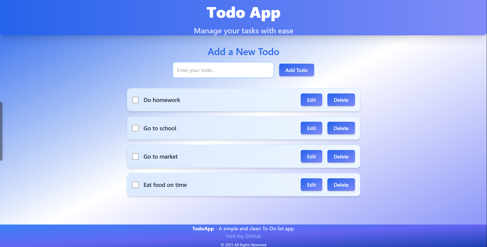

# Todo App

A simple and clean Todo List application built with React. The app allows you to manage tasks, mark them as completed, edit them, and delete them. It features a beautiful gradient background and an interactive interface.

## Features

- Add new Todo items
- Mark Todo items as completed
- Edit Todo items
- Delete Todo items
- Clean and responsive design

## Tech Stack

- React.js (Frontend)
- Tailwind CSS (Styling)
- UUID (Unique ID generation for each Todo)

## Demo



## Installation

To run this app locally, follow the steps below:

### 1. Clone the Repository

First, clone the repository to your local machine:

```bash
git clone https://github.com/ankitNegiDev/TodoList
```

### 2. Install Dependencies

Navigate to the project folder and install the dependencies:

```bash
cd TodoApp
npm install
```

### 3. Run the Application

After the dependencies are installed, you can start the development server:

```bash
npm start
```

This will start the app on `http://localhost:3000/` by default. Open the URL in your browser to use the app.

### 4. Build the App for Production

To create a production build of the app, run:

```bash
npm run build
```

This will create an optimized build in the `build` directory, which can then be deployed to any static hosting service.

## How It Works

- The app has a list of Todo items that can be added, edited, checked off as completed, or deleted.
- The `uuid` library is used to generate unique IDs for each Todo.
- Tailwind CSS is used for styling, providing a clean and responsive design.
- The background color of the app is a gradient from blue to indigo, adding to the aesthetic appeal.

## Contributing

If you'd like to contribute to the project, feel free to fork it and create a pull request. Please make sure to follow the code style and include tests if applicable.

## License

This project is licensed under the MIT License - see the [LICENSE](LICENSE) file for details.

## Author

Made with 💙 by [Your Name](https://github.com/your-username).
